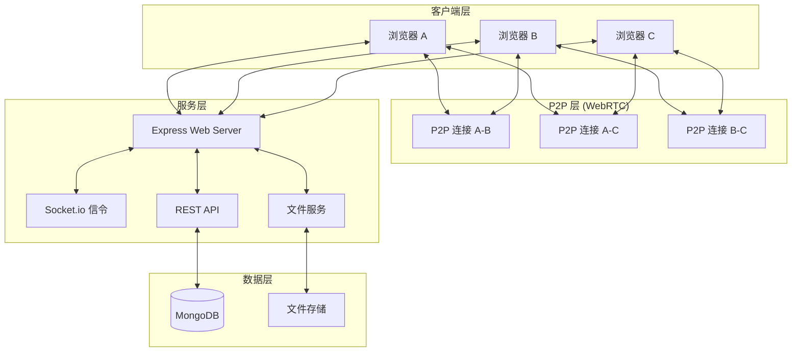
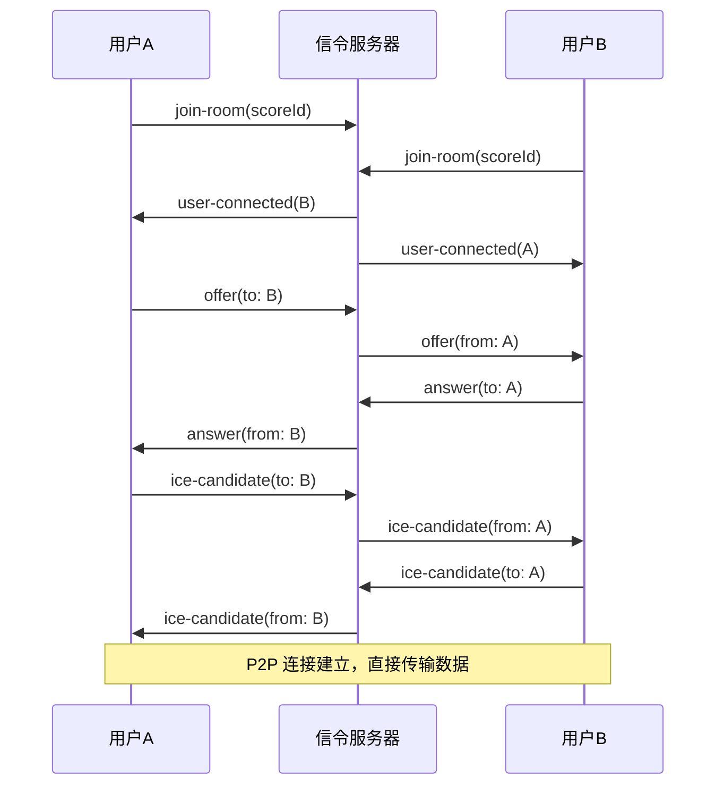

# PDF 乐谱协同批注系统 - 技术架构文档

## 1. 技术栈选型

### 1.1 后端技术栈
| 组件 | 技术选型 | 版本 | 说明 |
|------|----------|------|------|
| 运行时 | Node.js | 18+ | JavaScript 服务端运行环境 |
| Web 框架 | Express | ^4.18 | 轻量级 Web 服务框架 |
| 数据库 | MongoDB | 6.0+ | NoSQL 文档数据库 |
| ODM | Mongoose | ^7.0 | MongoDB 对象建模工具 |
| WebSocket | Socket.io | ^4.6 | WebRTC 信令服务器 |
| 文件上传 | Multer | ^1.4 | 文件上传中间件 |
| 认证 | JWT | ^9.0 | JSON Web Token 认证 |
| 密码加密 | bcrypt | ^5.1 | 密码哈希加密 |

### 1.2 前端技术栈
| 组件 | 技术选型 | 版本 | 说明 |
|------|----------|------|------|
| 框架 | React | ^18.2 | 用户界面构建库 |
| 构建工具 | Vite | ^5.0 | 快速构建工具 |
| 画布库 | Fabric.js | ^5.3 | 交互式画布渲染 |
| PDF 渲染 | PDF.js | ^3.11 | Mozilla PDF 渲染库 |
| WebRTC | Simple-Peer | ^9.11 | WebRTC P2P 连接封装 |
| 状态管理 | Zustand | ^4.4 | 轻量级状态管理 |
| HTTP 客户端 | Axios | ^1.6 | HTTP 请求库 |
| UI 组件 | Ant Design | ^5.12 | React UI 组件库 |
| 样式 | Tailwind CSS | ^3.4 | CSS 工具类框架 |

## 2. 系统架构

### 2.1 整体架构图



### 2.2 目录结构

```
score-collab/
├── server/                 # 后端服务
│   ├── src/
│   │   ├── models/        # 数据模型
│   │   ├── controllers/   # 控制器
│   │   ├── routes/        # 路由定义
│   │   ├── middleware/    # 中间件
│   │   ├── socket/        # Socket.io 信令
│   │   ├── config/        # 配置文件
│   │   └── server.js      # 入口文件
│   ├── uploads/           # 上传文件存储
│   └── package.json
│
├── client/                 # 前端应用
│   ├── src/
│   │   ├── components/    # React 组件
│   │   ├── hooks/         # 自定义 Hooks
│   │   ├── store/         # Zustand 状态
│   │   ├── services/      # API 服务
│   │   ├── utils/         # 工具函数
│   │   └── App.jsx        # 根组件
│   ├── public/
│   └── package.json
│
└── .trae/
    └── documents/
```

## 3. 数据模型设计

### 3.1 User (用户模型)
```javascript
{
  _id: ObjectId,
  email: String (unique),
  password: String (hashed),
  name: String,
  avatar: String,
  createdAt: Date,
  updatedAt: Date
}
```

### 3.2 Score (乐谱模型)
```javascript
{
  _id: ObjectId,
  title: String,
  fileName: String,
  filePath: String,
  fileSize: Number,
  pageCount: Number,
  createdBy: ObjectId (ref User),
  collaborators: [
    {
      userId: ObjectId (ref User),
      role: Enum ('creator', 'editor', 'viewer')
    }
  ],
  createdAt: Date,
  updatedAt: Date
}
```

### 3.3 Annotation (批注模型)
```javascript
{
  _id: ObjectId,
  scoreId: ObjectId (ref Score),
  page: Number,
  type: Enum ('highlight', 'pen', 'text', 'metronome'),
  data: Object,
  color: String,
  createdBy: ObjectId (ref User),
  createdAt: Date,
  updatedAt: Date
}
```

### 3.4 Version (版本模型)
```javascript
{
  _id: ObjectId,
  scoreId: ObjectId (ref Score),
  version: Number,
  snapshot: [Annotation],
  createdBy: ObjectId (ref User),
  description: String,
  createdAt: Date
}
```

## 4. API 接口设计

### 4.1 认证接口
| 方法 | 路径 | 说明 |
|------|------|------|
| POST | /api/auth/register | 用户注册 |
| POST | /api/auth/login | 用户登录 |
| GET | /api/auth/me | 获取当前用户 |

### 4.2 乐谱接口
| 方法 | 路径 | 说明 |
|------|------|------|
| GET | /api/scores | 获取乐谱列表 |
| POST | /api/scores | 上传乐谱 |
| GET | /api/scores/:id | 获取乐谱详情 |
| DELETE | /api/scores/:id | 删除乐谱 |
| POST | /api/scores/:id/share | 分享乐谱 |

### 4.3 批注接口
| 方法 | 路径 | 说明 |
|------|------|------|
| GET | /api/scores/:id/annotations | 获取批注列表 |
| POST | /api/scores/:id/annotations | 添加批注 |
| PUT | /api/annotations/:id | 更新批注 |
| DELETE | /api/annotations/:id | 删除批注 |

### 4.4 版本接口
| 方法 | 路径 | 说明 |
|------|------|------|
| GET | /api/scores/:id/versions | 获取版本列表 |
| POST | /api/scores/:id/versions | 创建版本快照 |
| POST | /api/versions/:id/restore | 恢复到指定版本 |

## 5. WebRTC 信令设计

### 5.1 Socket.io 事件

**连接事件:**
- `join-room(scoreId)`: 加入乐谱房间
- `leave-room(scoreId)`: 离开乐谱房间
- `user-connected`: 用户加入通知
- `user-disconnected`: 用户离开通知

**信令事件:**
- `offer`: 发送 WebRTC offer
- `answer`: 发送 WebRTC answer
- `ice-candidate`: 发送 ICE 候选

**数据同步事件:**
- `annotation-add`: 新增批注
- `annotation-update`: 更新批注
- `annotation-delete`: 删除批注
- `page-change`: 页码切换

### 5.2 连接流程



## 6. 核心技术实现

### 6.1 Fabric.js 批注实现
- **高亮**: fabric.Rect，设置 opacity 和 fill
- **自由画笔**: fabric.Path，记录鼠标移动路径
- **文本标签**: fabric.IText，支持编辑
- **节拍器标记**: fabric.Circle + fabric.Text 组合

### 6.2 PDF.js 渲染流程
1. 加载 PDF 文档
2. 获取指定页面
3. 渲染到 Canvas
4. 将 Fabric.js 画布叠加在 PDF 画布上方

### 6.3 版本控制策略
- 每次保存操作自动创建版本快照
- 存储完整批注数据副本
- 恢复时清除当前批注，用历史版本替换

## 7. 部署配置

### 7.1 环境变量
**后端 (.env):**
```
PORT=5000
MONGODB_URI=mongodb://localhost:27017/score-collab
JWT_SECRET=your-secret-key
UPLOAD_PATH=./uploads
```

**前端 (.env):**
```
VITE_API_URL=http://localhost:5000/api
VITE_SOCKET_URL=http://localhost:5000
```
