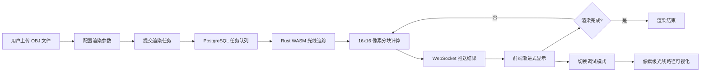

## 1. 产品概述
基于 WebAssembly 的实时光线追踪渲染平台，支持用户上传 3D 场景并进行高质量渲染计算
- 解决传统光线追踪计算耗时、需要专业硬件的问题，通过 Web 端提供渐进式渲染体验
- 面向 3D 设计师、游戏开发者和计算机图形学爱好者

## 2. 核心功能

### 2.1 用户角色
| 角色 | 注册方式 | 核心权限 |
|------|----------|----------|
| 普通用户 | 无需注册 | 上传 OBJ 文件、设置渲染参数、查看渲染结果、使用调试模式 |

### 2.2 功能模块
1. **主渲染页面**: 场景上传、参数配置、渲染画布、任务管理
2. **调试面板**: 光线路径可视化、相交三角形高亮、着色计算中间值展示

### 2.3 页面详情
| 页面名称 | 模块名称 | 功能描述 |
|----------|----------|----------|
| 主渲染页面 | 场景上传区 | 支持拖拽上传 OBJ 文件，显示文件信息和预览 |
| 主渲染页面 | 参数配置区 | 设置采样数、反射深度、光源位置坐标 |
| 主渲染页面 | 渲染画布 | Three.js 显示渐进式渲染结果，分块加载动画 |
| 主渲染页面 | 任务队列 | 显示当前和历史渲染任务状态 |
| 调试面板 | 光线路径 | 显示选中像素的光线反弹路径树，3D 可视化 |
| 调试面板 | 相交信息 | 高亮显示光线相交的三角形和面片 |
| 调试面板 | 着色数据 | 展示每个着色步骤的中间计算值和贡献度 |

## 3. 核心流程

用户上传 OBJ 场景文件 → 配置渲染参数 → 提交渲染任务 → 后端分块计算 → WebSocket 实时推送结果 → 前端渐进式显示 → 完成渲染或切换调试模式

## 4. 用户界面设计

### 4.1 设计风格
- **主色调**: 深空蓝 (#0A1628) 配合科技蓝 (#00D4FF) 点缀
- **辅助色**: 警告黄 (#FFB800)、成功绿 (#00FF88)
- **按钮风格**: 圆角 8px，带微妙发光效果，悬停时有脉冲动画
- **字体**: 标题使用 Orbitron（科技感），正文使用 JetBrains Mono（等宽易读）
- **布局风格**: 三栏布局，左侧参数面板，中央渲染画布，右侧调试信息
- **视觉风格**: 赛博朋克 / 科技感，深色主题，网格背景，发光边框

### 4.2 页面设计概览
| 页面名称 | 模块名称 | UI 元素 |
|----------|----------|----------|
| 主渲染页面 | 场景上传区 | 虚线边框拖拽区域，文件图标动画，进度条 |
| 主渲染页面 | 参数配置区 | 滑块控件带实时数值显示，3D 坐标输入器 |
| 主渲染页面 | 渲染画布 | 网格加载动画，分块淡入效果，像素信息悬停 |
| 主渲染页面 | 任务队列 | 卡片式任务列表，状态指示灯，进度圆环 |
| 调试面板 | 光线路径 | 3D 线框渲染，节点标记，颜色编码反弹次数 |
| 调试面板 | 相交信息 | 三角形高亮，面索引显示，法向量箭头 |
| 调试面板 | 着色数据 | 热力图可视化，数值条形图，贡献占比饼图 |

### 4.3 响应式
- 桌面端：三栏固定布局，画布自适应居中
- 平板：左右面板可折叠，画布占满宽度
- 移动端：单列布局，画布优先，参数面板可滑动呼出

### 4.4 3D 场景指导
- **环境**: 深色科技感背景，网格地板，微弱体积光
- **光照**: 主方向灯 + 环境光，调试模式下显示光源位置标记
- **相机**: 轨道控制器，支持缩放旋转，调试模式自动对焦选中像素
- **交互**: 悬停高亮面片，点击显示详细信息，滚轮调整采样预览质量
- **后期处理**:  bloom 发光效果，轻微色差，胶片颗粒增加质感
- **性能**: 分块渲染时降低画布分辨率，完成后切换全分辨率
