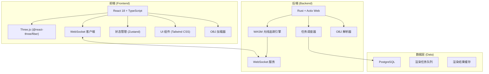
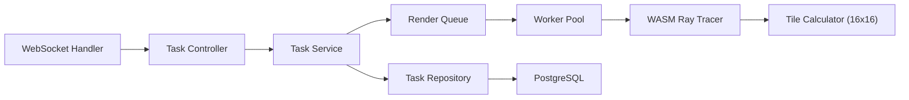
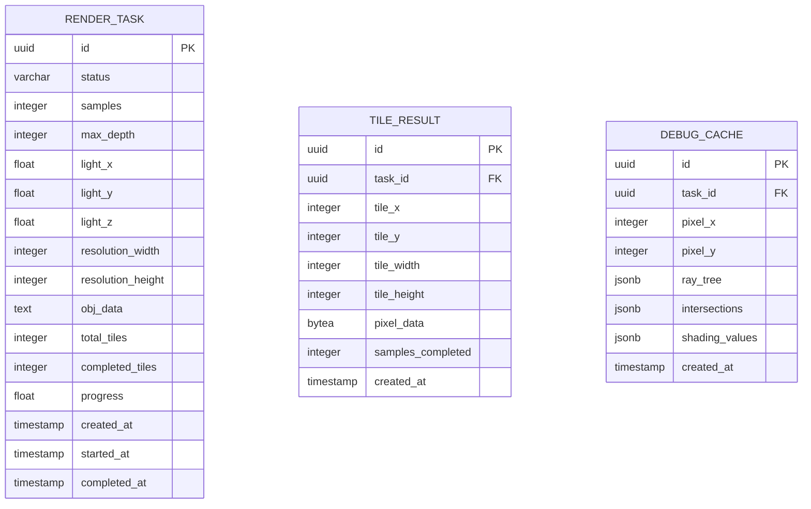

## 1. 架构设计



## 2. 技术描述

- **前端**: React@18 + TypeScript + TailwindCSS@3 + Vite
- **3D 渲染**: Three.js + @react-three/fiber + @react-three/drei
- **后端**: Rust + Actix Web + WebSocket
- **WASM**: wasm-bindgen + wasm-pack
- **数据库**: PostgreSQL + sqlx
- **状态管理**: Zustand
- **通信**: WebSocket (渐进式数据传输)

## 3. 路由定义

| 路由 | 用途 |
|------|------|
| / | 主渲染页面 |
| /tasks | 任务历史页面 |
| /debug/:taskId | 调试模式页面 |

## 4. API 定义

### WebSocket 消息类型

```typescript
// 客户端 -> 服务器
interface RenderRequest {
  type: 'render_request';
  taskId: string;
  objData: string;
  params: {
    samples: number;
    maxDepth: number;
    lightPosition: { x: number; y: number; z: number };
    resolution: { width: number; height: number };
  };
}

interface DebugPixelRequest {
  type: 'debug_pixel';
  taskId: string;
  x: number;
  y: number;
}

// 服务器 -> 客户端
interface TileResult {
  type: 'tile_result';
  taskId: string;
  tileX: number;
  tileY: number;
  tileWidth: number;
  tileHeight: number;
  pixels: number[]; // RGBA 扁平化数组
  samplesCompleted: number;
}

interface DebugPixelResult {
  type: 'debug_pixel_result';
  taskId: string;
  x: number;
  y: number;
  rayTree: RayNode[];
  intersections: IntersectionData[];
  shadingValues: ShadingValue[];
}

interface TaskStatus {
  type: 'task_status';
  taskId: string;
  status: 'queued' | 'rendering' | 'completed' | 'error';
  progress: number;
  totalTiles: number;
  completedTiles: number;
}

interface RayNode {
  id: string;
  origin: { x: number; y: number; z: number };
  direction: { x: number; y: number; z: number };
  depth: number;
  children: string[];
  color: { r: number; g: number; b: number };
}

interface IntersectionData {
  triangleIndex: number;
  point: { x: number; y: number; z: number };
  normal: { x: number; y: number; z: number };
  uv: { u: number; v: number };
  material: string;
}

interface ShadingValue {
  step: string;
  value: { r: number; g: number; b: number };
  contribution: number;
  description: string;
}
```

## 5. 服务器架构图



## 6. 数据模型

### 6.1 数据模型定义



### 6.2 数据定义语言

```sql
CREATE EXTENSION IF NOT EXISTS "uuid-ossp";

CREATE TABLE render_task (
    id UUID PRIMARY KEY DEFAULT uuid_generate_v4(),
    status VARCHAR(20) NOT NULL DEFAULT 'queued',
    samples INTEGER NOT NULL,
    max_depth INTEGER NOT NULL,
    light_x FLOAT NOT NULL,
    light_y FLOAT NOT NULL,
    light_z FLOAT NOT NULL,
    resolution_width INTEGER NOT NULL,
    resolution_height INTEGER NOT NULL,
    obj_data TEXT NOT NULL,
    total_tiles INTEGER DEFAULT 0,
    completed_tiles INTEGER DEFAULT 0,
    progress FLOAT DEFAULT 0,
    created_at TIMESTAMP NOT NULL DEFAULT CURRENT_TIMESTAMP,
    started_at TIMESTAMP,
    completed_at TIMESTAMP
);

CREATE TABLE tile_result (
    id UUID PRIMARY KEY DEFAULT uuid_generate_v4(),
    task_id UUID NOT NULL REFERENCES render_task(id) ON DELETE CASCADE,
    tile_x INTEGER NOT NULL,
    tile_y INTEGER NOT NULL,
    tile_width INTEGER NOT NULL,
    tile_height INTEGER NOT NULL,
    pixel_data BYTEA NOT NULL,
    samples_completed INTEGER NOT NULL,
    created_at TIMESTAMP NOT NULL DEFAULT CURRENT_TIMESTAMP
);

CREATE TABLE debug_cache (
    id UUID PRIMARY KEY DEFAULT uuid_generate_v4(),
    task_id UUID NOT NULL REFERENCES render_task(id) ON DELETE CASCADE,
    pixel_x INTEGER NOT NULL,
    pixel_y INTEGER NOT NULL,
    ray_tree JSONB NOT NULL,
    intersections JSONB NOT NULL,
    shading_values JSONB NOT NULL,
    created_at TIMESTAMP NOT NULL DEFAULT CURRENT_TIMESTAMP,
    UNIQUE(task_id, pixel_x, pixel_y)
);

CREATE INDEX idx_render_task_status ON render_task(status);
CREATE INDEX idx_tile_result_task_id ON tile_result(task_id);
CREATE INDEX idx_debug_cache_task_pixel ON debug_cache(task_id, pixel_x, pixel_y);
```

## 7. 项目结构

```
project-root/
├── frontend/
│   ├── src/
│   │   ├── components/
│   │   │   ├── RenderCanvas.tsx
│   │   │   ├── ParameterPanel.tsx
│   │   │   ├── DebugPanel.tsx
│   │   │   ├── FileUploader.tsx
│   │   │   └── TaskList.tsx
│   │   ├── store/
│   │   │   └── useRenderStore.ts
│   │   ├── hooks/
│   │   │   ├── useWebSocket.ts
│   │   │   └── useRayDebug.ts
│   │   ├── types/
│   │   │   └── index.ts
│   │   └── App.tsx
│   ├── package.json
│   └── vite.config.ts
├── backend/
│   ├── src/
│   │   ├── main.rs
│   │   ├── routes/
│   │   ├── services/
│   │   ├── models/
│   │   ├── db/
│   │   └── raytracer/
│   │       ├── lib.rs
│   │       ├── camera.rs
│   │       ├── ray.rs
│   │       ├── hit.rs
│   │       ├── material.rs
│   │       └── obj_loader.rs
│   ├── Cargo.toml
│   └── migrations/
└── docker-compose.yml
```
