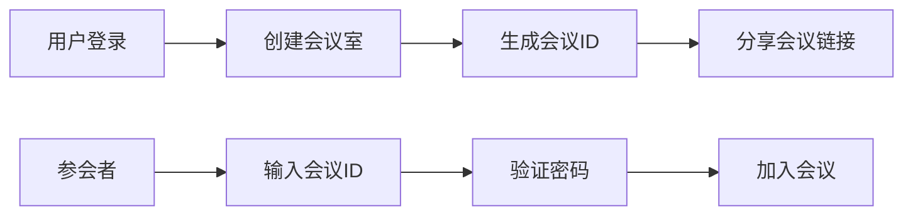
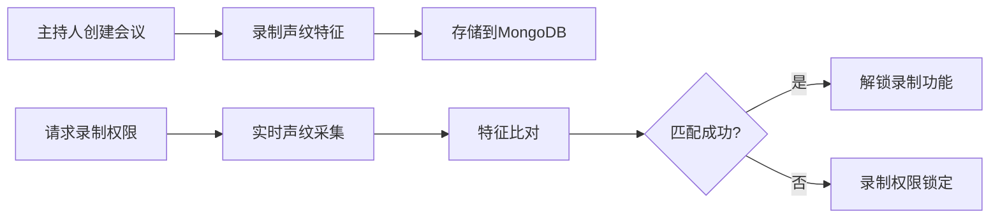

# WebRTC视频会议应用产品需求文档

## 1. 产品概述
一款基于WebRTC技术的现代化视频会议应用，支持多人实时音视频通话、AI背景替换和声纹认证录制功能。
- 解决远程会议中的隐私保护、内容安全和录制权限管理问题
- 目标用户：企业团队、教育机构、需要安全会议环境的组织

## 2. 核心功能

### 2.1 用户角色
| 角色 | 注册方式 | 核心权限 |
|------|----------|----------|
| 主持人 | 用户名/邮箱注册 | 创建会议室、设置声纹锁、管理录制权限 |
| 参会者 | 会议室链接加入 | 加入会议、音视频通话、背景替换 |

### 2.2 功能模块
1. **会议室大厅**: 创建/加入会议室、会议室列表
2. **视频会议页面**: 多人音视频通话、背景设置、声纹验证、录制控制
3. **录制管理**: 查看和下载录制文件

### 2.3 页面详情
| 页面名称 | 模块名称 | 功能描述 |
|-----------|-------------|---------------------|
| 会议室大厅 | 会议室创建 | 输入会议主题、设置密码、创建会议室 |
| 会议室大厅 | 加入会议 | 输入会议室ID和密码加入会议 |
| 视频会议 | 视频网格 | 显示所有参会者视频流 |
| 视频会议 | 背景设置 | 选择预设背景、上传自定义背景 |
| 视频会议 | 声纹验证 | 录制声纹、验证解锁录制权限 |
| 视频会议 | 录制控制 | 开始/停止录制、显示录制状态 |

## 3. 核心流程

### 3.1 会议创建与加入流程

### 3.2 声纹解锁录制流程

## 4. 用户界面设计

### 4.1 设计风格
- **主色调**: 深蓝色 (#165DFF) - 专业、科技感
- **辅助色**: 青色 (#00B42A) - 成功状态、橙色 (#FF7D00) - 警告
- **按钮风格**: 圆角矩形、微渐变、悬停阴影效果
- **字体**: Inter - 现代无衬线字体，标题18-24px，正文14px
- **布局风格**: 卡片式布局、深色主题、玻璃态效果
- **图标风格**: Lucide线性图标，统一24px尺寸

### 4.2 页面设计概述
| 页面名称 | 模块名称 | UI元素 |
|-----------|-------------|-------------|
| 会议室大厅 | 顶部导航 | Logo、用户头像、导航菜单 |
| 会议室大厅 | 创建区域 | 大型渐变卡片、表单输入、创建按钮 |
| 视频会议 | 视频网格 | CSS Grid布局、等比分屏、悬停高亮 |
| 视频会议 | 控制栏 | 底部固定、半透明背景、图标按钮组 |
| 视频会议 | 侧边栏 | 背景选择器、声纹验证面板、参会者列表 |

### 4.3 响应式
- 桌面端优先，适配1280px以上分辨率
- 平板端：侧边栏折叠、视频网格自适应
- 移动端：垂直布局、控制栏简化、触摸优化

### 4.4 动效设计
- 视频流加载：淡入动画 + 轻微缩放
- 背景切换：平滑过渡动画 300ms
- 按钮交互：悬停放大 1.05x + 阴影增强
- 页面切换：滑动过渡效果
