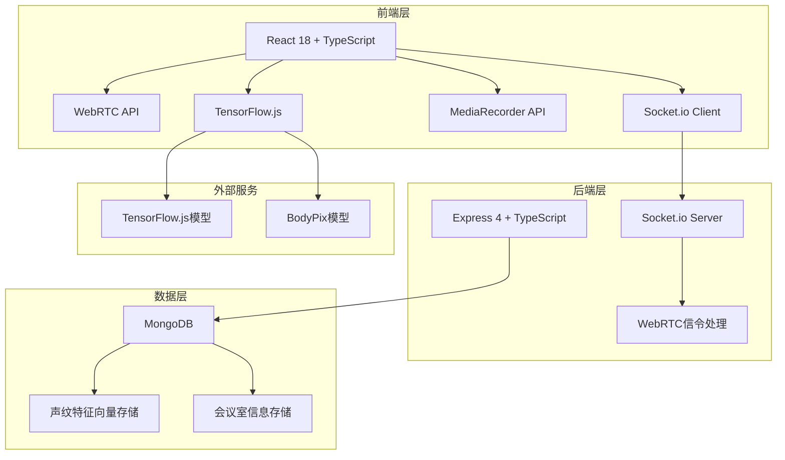
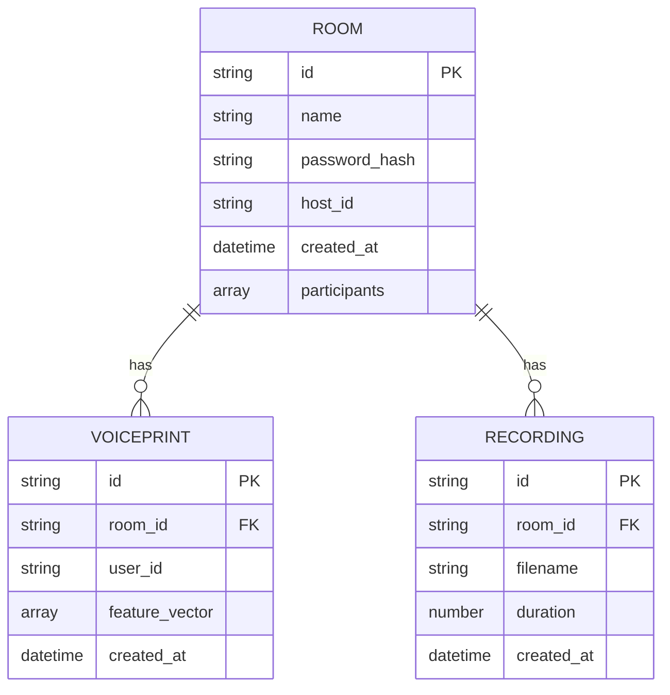

# WebRTC视频会议应用技术架构文档

## 1. 架构设计



## 2. 技术描述

- **前端**: React@18 + TypeScript + TailwindCSS@3 + Vite
- **状态管理**: Zustand
- **路由**: React Router DOM@6
- **图标**: Lucide React
- **后端**: Express@4 + TypeScript + Socket.io
- **数据库**: MongoDB + Mongoose
- **AI引擎**: TensorFlow.js + BodyPix (人像分割)
- **音视频处理**: WebRTC + MediaRecorder API (WebM格式)
- **声纹处理**: Web Audio API + 自定义MFCC特征提取

## 3. 目录结构

```
b91/
├── src/                          # 前端代码
│   ├── components/               # 组件
│   │   ├── VideoGrid.tsx        # 视频网格
│   │   ├── VideoPlayer.tsx      # 视频播放器
│   │   ├── ControlBar.tsx       # 控制栏
│   │   ├── BackgroundSelector.tsx # 背景选择器
│   │   ├── VoiceprintPanel.tsx  # 声纹验证面板
│   │   └── Sidebar.tsx          # 侧边栏
│   ├── pages/                    # 页面
│   │   ├── Lobby.tsx            # 大厅页面
│   │   └── Conference.tsx       # 会议页面
│   ├── hooks/                    # 自定义Hooks
│   │   ├── useWebRTC.ts         # WebRTC逻辑
│   │   ├── useBackgroundSeg.ts  # 背景分割
│   │   ├── useVoiceprint.ts     # 声纹处理
│   │   └── useRecorder.ts       # 录制功能
│   ├── store/                    # 状态管理
│   │   └── useConferenceStore.ts
│   ├── types/                    # 类型定义
│   │   └── index.ts
│   ├── utils/                    # 工具函数
│   │   ├── audioFeatures.ts     # 音频特征提取
│   │   └── webrtcUtils.ts
│   ├── App.tsx
│   └── main.tsx
├── api/                          # 后端代码
│   ├── index.ts                 # 服务器入口
│   ├── socket/                  # Socket.io处理
│   │   └── signaling.ts
│   ├── models/                  # 数据库模型
│   │   ├── Room.ts              # 会议室模型
│   │   └── Voiceprint.ts        # 声纹模型
│   ├── routes/                  # API路由
│   │   ├── rooms.ts
│   │   └── voiceprint.ts
│   ├── middleware/              # 中间件
│   └── config/                  # 配置
│       └── database.ts
├── shared/                       # 共享类型
│   └── types.ts
├── public/                       # 静态资源
│   └── backgrounds/             # 预设背景图
├── .trae/documents/              # 文档
├── package.json
├── tsconfig.json
├── vite.config.ts
└── tailwind.config.js
```

## 4. 路由定义

| 路由 | 用途 |
|-------|---------|
| / | 会议室大厅 - 创建/加入会议 |
| /room/:roomId | 视频会议页面 |

## 5. API定义

### 5.1 会议室相关

```typescript
// 创建会议室
POST /api/rooms
Request: { name: string, password: string, hostId: string }
Response: { roomId: string, success: boolean }

// 获取会议室信息
GET /api/rooms/:roomId
Response: { 
  id: string, 
  name: string, 
  participants: string[],
  hasVoiceprintLock: boolean
}

// 验证会议室密码
POST /api/rooms/:roomId/verify
Request: { password: string }
Response: { valid: boolean }
```

### 5.2 声纹相关

```typescript
// 注册声纹
POST /api/voiceprint/register
Request: { 
  roomId: string, 
  userId: string, 
  features: number[] 
}
Response: { success: boolean }

// 验证声纹
POST /api/voiceprint/verify
Request: { 
  roomId: string, 
  userId: string, 
  features: number[] 
}
Response: { match: boolean, similarity: number }
```

## 6. Socket.io信令事件

```typescript
// 客户端事件
interface ClientToServerEvents {
  'join-room': (roomId: string, userId: string) => void
  'leave-room': (roomId: string, userId: string) => void
  'offer': (data: { target: string, offer: RTCSessionDescriptionInit }) => void
  'answer': (data: { target: string, answer: RTCSessionDescriptionInit }) => void
  'ice-candidate': (data: { target: string, candidate: RTCIceCandidateInit }) => void
  'toggle-video': (roomId: string, userId: string, enabled: boolean) => void
  'toggle-audio': (roomId: string, userId: string, enabled: boolean) => void
}

// 服务端事件
interface ServerToClientEvents {
  'user-joined': (userId: string) => void
  'user-left': (userId: string) => void
  'offer': (data: { from: string, offer: RTCSessionDescriptionInit }) => void
  'answer': (data: { from: string, answer: RTCSessionDescriptionInit }) => void
  'ice-candidate': (data: { from: string, candidate: RTCIceCandidateInit }) => void
  'participants': (userIds: string[]) => void
}
```

## 7. 数据模型

### 7.1 ER图



### 7.2 Mongoose Schema

```typescript
// Room Schema
const roomSchema = new Schema({
  name: { type: String, required: true },
  passwordHash: { type: String, required: true },
  hostId: { type: String, required: true },
  participants: [{ type: String }],
  hasVoiceprintLock: { type: Boolean, default: false },
  createdAt: { type: Date, default: Date.now }
});

// Voiceprint Schema
const voiceprintSchema = new Schema({
  roomId: { type: Schema.Types.ObjectId, ref: 'Room', required: true },
  userId: { type: String, required: true },
  featureVector: { type: [Number], required: true },
  createdAt: { type: Date, default: Date.now }
});
```
